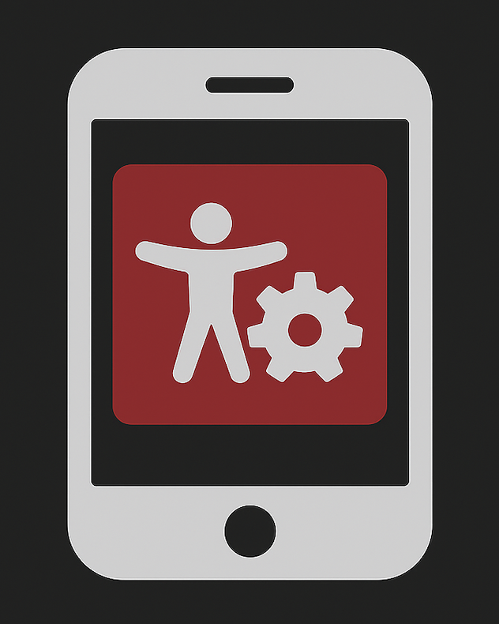

# iOS Automated Accessibility Demo

 

This repo houses automated accessibility examples for iOS developed applications using XCUI for UI regression tests

## Purpose

To help developers build a better automated accessibiltiy testing process in iOS applications. We want to build a better more robust set of automated accessibiltiy tests, and this repo will showcase the different type of testing you can do. 

## Project Structure

### Accessibility Audit Example

This testing example uses the 'performAccessibilityAudit()' function that comes with XCUI and runs a set of accessibility checks against the content you select. In this case it runs test cases against the 3 core screens in the test application. 

Heres one example of the usage: 

' swift 

    func testLoginScreenAccessibilityAudit() throws {
           XCUIApplication().tabBars.buttons["Home"].tap()
           try app.performAccessibilityAudit()
    }

'
