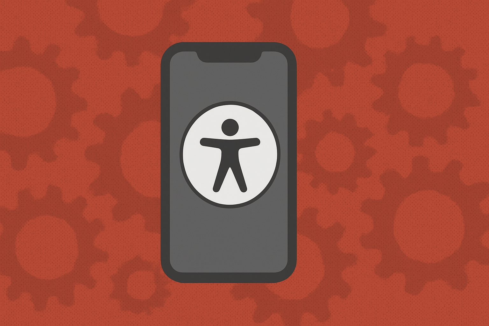

# iOS Automated Accessibility Example Lib
<div align="center">
 
</div>


This repo houses automated accessibility examples for iOS developed applications using XCUI for UI regression tests

## Purpose

To help developers build a better automated accessibiltiy testing process in iOS applications. We want to build a better more robust set of automated accessibiltiy tests, and this repo will showcase the different type of testing you can do. 


## Project Structure

All of automated test cases live in the `a11yDemoUITests` folder or `a11ydemoTests`. Each test file contains different ways in which to test automatically for accessibility issues in UI regression tests. 

### Accessibility Audit Example

This testing example uses the `performAccessibilityAudit()` function that comes with XCUI and runs a set of accessibility checks against the content you select. In this case it runs test cases against the 3 core screens in the test application. 

Heres one example of the usage: 

``` swift

    func testLoginScreenAccessibilityAudit() throws {
           XCUIApplication().tabBars.buttons["Home"].tap()
           try app.performAccessibilityAudit()
    }
```

For more information on this, see the following: https://developer.apple.com/documentation/xcuiautomation/xcuiaccessibilityaudittype 

### Accessibility Snapshot example

This test example demonstrates the usage of Accessibility snapshot library, which creates an accessibility hierarchy snapshot. If anything in the view changes within the accessibility hierarchy, the test case will fail and showcase the difference in compared to the original snapshot. 

Here simple usage: 

``` swift

 func testHomeScreenAccessibility() {
        let home = HomeView()
        
        let hostingController = UIHostingController(rootView: home)
        hostingController.view.frame = UIScreen.main.bounds
        assertSnapshot(matching: hostingController, as: .accessibilityImage)
    }

```

For more information on accessibility snapshot testing, see the following: [https://developer.apple.com/documentation/xcuiautomation/xcuiaccessibilityaudittype ](https://github.com/cashapp/AccessibilitySnapshot)
